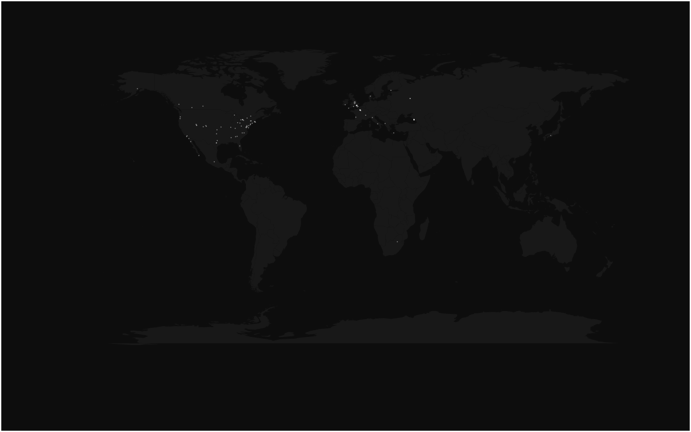

# TwitVis
### A Spatial Tweet Visualization Tool.

TwitVis is a tool for visualizing locations of tweets about a specific topic over time. The output is a number of images which can be used standalone or combined using `ffmpeg` to show the development as a video.

## Usage
### Real-Time Monitoring
For plotting tweets about 'sochi' and 'olympics' to the output directory `plots`:

`> ruby twit_vis.rb -r -t sochi,olympics -o plots`

### Historical Analysis
For plotting historical tweets about 'olympics' to the output directory `plots`:

`> ruby twit_vis.rb -h -t olympics -o plots`

### Generating Video
For generating a video, use the `mkvid.sh` shell script with the output dir:

`> ./mkvid.sh plots`

An optional frame rate can be given as the second argument (here a frame rate of 10):

`> ./mkvid.sh plots 10`

Example:

